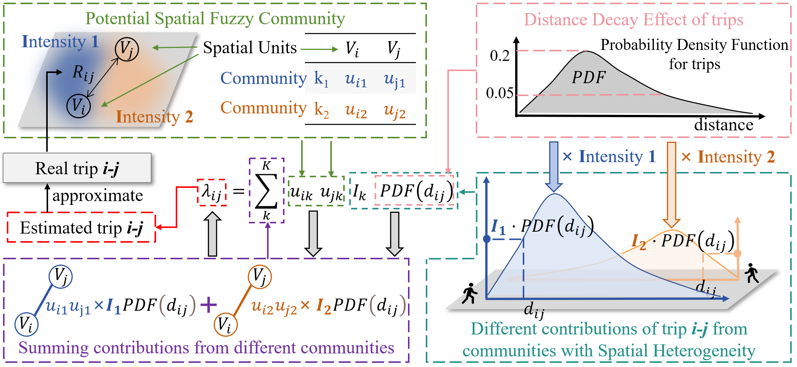
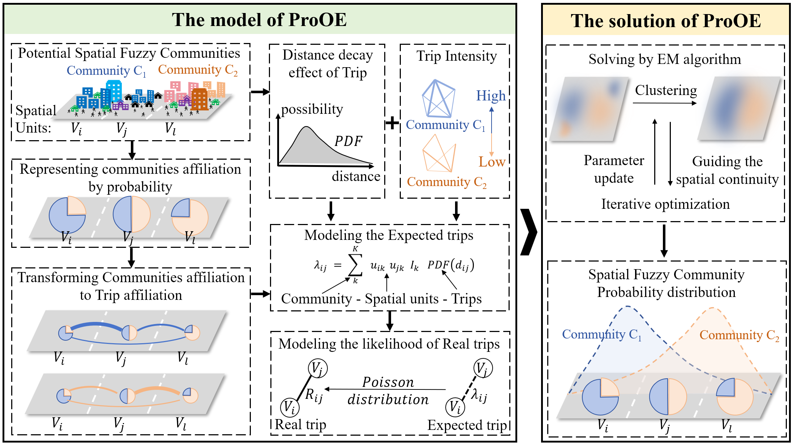

# ProOE

This is the implementation of Paper: "A Probabilistic Optimal Estimation Method for Detecting Spatial Fuzzy Communities" (IJGIS, 2025).

<a href="链接到论文的URL"></a>&nbsp;&nbsp;&nbsp;<a href="https://github.com/HeXiao2001/ProOE/tree/main/data/input"></a>&nbsp;&nbsp;&nbsp;<a href="https://github.com/HeXiao2001/ProOE/tree/main?tab=MIT-1-ov-file"></a>
    



## Model Overview

ProOE (Probabilistic Optimal Estimation) is a novel approach for detecting spatial fuzzy communities. The algorithm utilizes a probabilistic framework to identify community structures with fuzzy boundaries in spatial networks. It is particularly useful for analyzing urban mobility patterns, transportation networks, and social interactions in geographic space.




## Running Examples

There are two ways to run the code:

1. (Recommended)You can run the `demo.ipynb` file, which includes the step-by-step instructions to reproduce findings reported in the manuscript. The processing and visualization of the New York City taxi dataset and three simulated datasets are organized in it. Visualizations include spatial fuzzy community division results, Trip Matrix, Confidence Index, and Certainty Index. 

2. Alternatively, you can run the `main.py` file. The New York City taxi dataset and three simulated datasets are also available, and you can easily switch between datasets.

The results are saved in the `./data/output` directory, organized by dataset name. You can open this directory to view the detailed data.

Please note that we tested the code on a PC with a 3.50 GHz CPU and 64 GB memory running the Windows 11 operating system. Different device conditions may affect the results.


## Requirements
- python 3.12.5
- numpy
- pandas
- geopandas
- matplotlib
- scipy
- mpl_toolkits
- termcolor
- hdbscan
- Contextily

## Project Structure

```
ProOE/
├── data/                  # Data directory
│   ├── input/             # Input datasets
│   │   ├── continuous/    # Simulated dataset for testing continuity
│   │   ├── fuzziness/     # Simulated dataset for testing fuzziness
│   │   ├── heterogeneity/ # Simulated dataset for testing heterogeneity
│   │   └── NYC_taxi/      # Real-world NYC taxi dataset
│   └── output/            # Output results organized by dataset
├── model/                 # Model implementation
│   ├── model.py           # Core ProOE model
│   └── utils.py           # Utility functions for the model
├── demo.ipynb             # Step-by-step demonstration notebook
├── main.py                # Main script for running the algorithm
├── Core4model.png         # Core idea illustration
├── Framework.png          # Framework overview
├── visual_utils.py        # Utilities for visualization
└── README.md              # This file
```

## Dataset Description

Our implementation includes four datasets:

1. **NYC Taxi Dataset** - Real-world taxi trip data from New York City
2. **Continuous Simulation Dataset** - For testing spatial continuity effects
3. **Fuzziness Simulation Dataset** - For evaluating performance with fuzzy boundaries
4. **Heterogeneity Simulation Dataset** - For assessing the impact of intra-community heterogeneity

Each dataset contains three key files:
- `Distances.csv`: Distance matrix between spatial units
- `Flows.csv`: Flow matrix between spatial units
- `SpatialUnit.geojson`: Geospatial information of spatial units


## Citation

If you find this code or work helpful for your research, please cite our paper:

```
Author, A., Author, B., & Author, C. (2023). A Probabilistic Optimal Estimation Method for Detecting Spatial Fuzzy Communities. Journal Name, Volume(Issue), Pages.
```

BibTeX format:

```bibtex
@article{author2023probabilistic,
  title={A Probabilistic Optimal Estimation Method for Detecting Spatial Fuzzy Communities},
  author={Author, A. and Author, B. and Author, C.},
  journal={Journal Name},
  volume={Volume},
  number={Issue},
  pages={Pages},
  year={2023},
  publisher={Publisher}
}
```

Please consider giving it a star ⭐ on GitHub.

## Tips

- **Extensibility**: The ProOE model is highly extensible. By replacing the PDF function (which represents spatial effects in our work), the model can potentially be adapted to various other domains and applications.

- **Scalability Considerations**: While effective for the datasets presented in this paper, the current solving algorithm may face challenges with extremely large-scale datasets. Performance optimizations may be necessary for applications involving massive networks.

- **Future Improvements**: We welcome suggestions and contributions for algorithm improvements, particularly in the areas of computational efficiency and convergence speed. If you have ideas for enhancing the model's performance, please feel free to open an issue or submit a pull request.

- **Parameter Tuning**: For optimal results, experiment with different values of K (number of communities) and alpha (spatial constraint parameter) based on your specific application context.


## Contact

For any questions or suggestions, please contact: [hexiaoemail@csu.edu.cn](mailto:hexiaoemail@csu.edu.cn)

## Acknowledgments
We thank Cdlib, NetworkX, Contextily, and other Python open-source libraries for their invaluable support in community detection, network analysis, and map visualization in this study.

## License

This project is licensed under the MIT License - see the LICENSE file for details.
